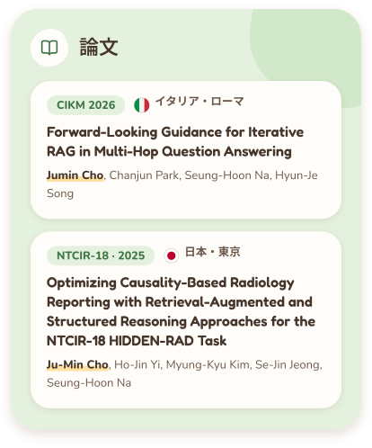
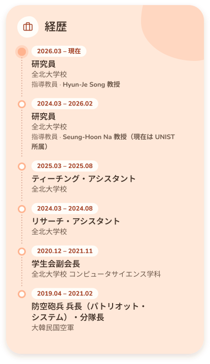
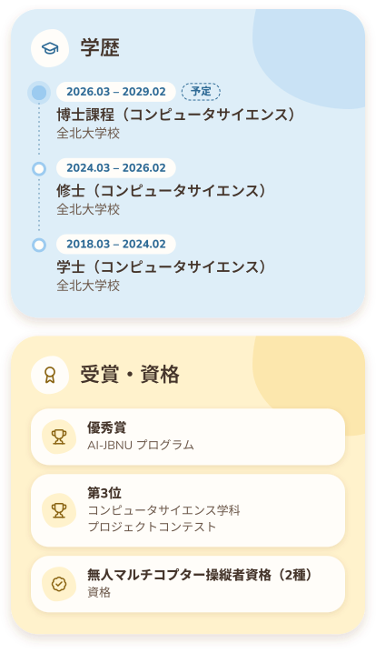

<!--
  Generated by `npm run github-profile` in https://github.com/jumincho/juminwho
  from src/data/profile.ts. Edit the data there and regenerate; do not edit this file.
  .github/workflows/age.yml redraws the age in assets/*/glance-*.svg every day.
-->

<a href="https://github.com/jumincho"><picture><source media="(prefers-color-scheme: dark)" srcset="assets/lang/lang-en-dark.svg" /></picture></a>
<a href="https://github.com/jumincho/jumincho/blob/main/README.zh-CN.md"><picture><source media="(prefers-color-scheme: dark)" srcset="assets/lang/lang-zh-CN-dark.svg" /></picture></a>
<a href="https://github.com/jumincho/jumincho/blob/main/README.zh-HK.md"><picture><source media="(prefers-color-scheme: dark)" srcset="assets/lang/lang-zh-HK-dark.svg" /></picture></a>
<a href="https://github.com/jumincho/jumincho/blob/main/README.ja.md"><picture><source media="(prefers-color-scheme: dark)" srcset="assets/lang/lang-ja-on-dark.svg" /></picture></a>
<a href="https://github.com/jumincho/jumincho/blob/main/README.ko.md"><picture><source media="(prefers-color-scheme: dark)" srcset="assets/lang/lang-ko-dark.svg" /></picture></a>

<a href="https://jumincho.github.io/juminwho/?lang=ja"><picture><source media="(prefers-color-scheme: dark)" srcset="assets/ja/hero-dark.svg" /></picture></a>

<a href="https://jumincho.github.io/juminwho/?lang=ja"><picture><source media="(prefers-color-scheme: dark)" srcset="assets/ja/button-portfolio-dark.svg" /></picture></a>
<a href="https://www.linkedin.com/in/jumin-cho-42b126338/"><picture><source media="(prefers-color-scheme: dark)" srcset="assets/ja/button-linkedin-dark.svg" /></picture></a>
<a href="https://sites.google.com/view/nlllab/main"><picture><source media="(prefers-color-scheme: dark)" srcset="assets/ja/button-lab-dark.svg" /></picture></a>

<code>properly59@gmail.com</code>

<a href="https://jumincho.github.io/juminwho/?lang=ja"><picture><source media="(prefers-color-scheme: dark)" srcset="assets/ja/glance-dark.svg" /></picture></a>
<a href="https://jumincho.github.io/juminwho/?lang=ja#publications"><picture><source media="(prefers-color-scheme: dark)" srcset="assets/ja/publications-dark.svg" /></picture></a>

<a href="https://jumincho.github.io/juminwho/?lang=ja#experience"><picture><source media="(prefers-color-scheme: dark)" srcset="assets/ja/experience-dark.svg" /></picture></a>
<a href="https://jumincho.github.io/juminwho/?lang=ja#education"><picture><source media="(prefers-color-scheme: dark)" srcset="assets/ja/education-dark.svg" /></picture></a>

<a href="https://jumincho.github.io/juminwho/?lang=ja"><picture><source media="(prefers-color-scheme: dark)" srcset="assets/ja/footer-dark.svg" /></picture></a>

