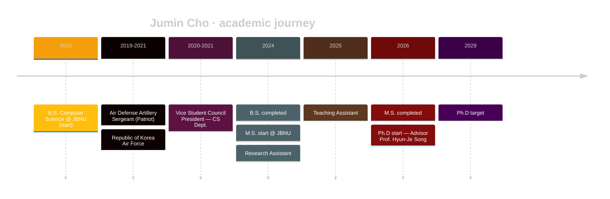

<!-- ============================ HEADER ============================ -->

<a href="#"></a>

<!-- ============================ INTRO ============================ -->

<div align="center">

<a href="https://github.com/jumincho"></a>

</div>

<!-- ============================ WALKOUT ============================ -->

<div align="center">



</div>

<br/>

<!-- ============================ ABOUT ============================ -->

## <samp>$\color{#F59E0B}\textsf{// whoami}$</samp>

```yaml
name        : Jumin Cho (조주민)
title       : AI Researcher · Ph.D Student
affiliation : Jeonbuk National University (JBNU)
lab         : NLLLab — sites.google.com/view/nlllab/main
advisor     : Prof. Hyun-Je Song
location    : Jeonju, South Korea
email       : properly59@gmail.com
```

<!-- ============================ RESEARCH ============================ -->

## <samp>$\color{#F59E0B}\textsf{// research}$</samp>

<table>
<tr>
<td valign="top" width="33%">

### Reasoning LLMs
Structured and retrieval-augmented reasoning for long-form generation.

</td>
<td valign="top" width="33%">

### Causality in NLP
Causality-aware models for high-stakes domains (e.g. radiology reports).

</td>
<td valign="top" width="33%">

### Trustworthy AI
Faithful, calibrated, and grounded language model outputs.

</td>
</tr>
</table>

> **Latest publication —** *Optimizing Causality-Based Radiology Reporting with Retrieval-Augmented and Structured Reasoning Approaches for the NTCIR-18 HIDDEN-RAD Task.*

<!-- ============================ STACK ============================ -->

## <samp>$\color{#F59E0B}\textsf{// stack}$</samp>

<p align="center">
  
</p>

<!-- ============================ TIMELINE ============================ -->

## <samp>$\color{#F59E0B}\textsf{// timeline}$</samp>



<!-- ============================ HONORS ============================ -->

## <samp>$\color{#F59E0B}\textsf{// honors}$</samp>

- **Excellence Award** — AI-JBNU Program
- **2nd Runner-up** — Department of Computer Science Project Competition
- **Unmanned Multi-Copter Pilot License** (Class 2)

<!-- ============================ CONNECT ============================ -->

## <samp>$\color{#F59E0B}\textsf{// connect}$</samp>

<p align="center">
  <a href="mailto:properly59@gmail.com"></a>
  <a href="https://www.linkedin.com/in/jumincho-42b126338"></a>
  <a href="https://sites.google.com/view/nlllab/main"></a>
</p>

<!-- ============================ FOOTER ============================ -->

<a href="#"></a>
