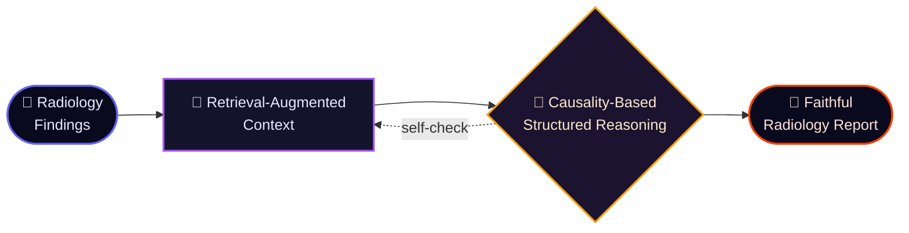

<!-- ╔═══════════════════════════════════════════════════════════════════╗ -->
<!-- ║   JUMIN CHO · github profile · crafted as an animated art piece    ║ -->
<!-- ╚═══════════════════════════════════════════════════════════════════╝ -->

<div align="center">


<br/>

<a href="https://readme-typing-svg.demolab.com">
  
</a>

<br/>

<a href="https://www.linkedin.com/in/jumin-cho-42b126338"></a>
<a href="https://sites.google.com/view/nlllab/main"></a>
<a href="https://jumincho.github.io/juminwho/"></a>
<a href="mailto:properly59@gmail.com"></a>

<br/>


</div>

## 👾 &nbsp;`whoami`

```bash
jumin@jbnu:~$ whoami
→ Jumin Cho (조주민) — "A Dreamer of an Artificial Intelligence Expert"

jumin@jbnu:~$ cat ./role.txt
→ AI Researcher · Ph.D. Student @ Jeonbuk National University
→ Natural Language & Learning (NLL) Lab · Advisor: Prof. Hyun-Je Song

jumin@jbnu:~$ ls ./research_focus/
→ natural-language-processing/   retrieval-augmented-generation/
→ structured-reasoning/          causality-based-reporting/
→ radiology-report-generation/   large-language-models/

jumin@jbnu:~$ uptime
→ B.S. → M.S. → Ph.D. · all in Computer Science · all @ JBNU · since 2018
```

<div align="center"></div>

## 🧠 &nbsp;Research — *what I actually build*

> **Optimizing Causality-Based Radiology Reporting with Retrieval-Augmented and
> Structured Reasoning Approaches for the NTCIR-18 HIDDEN-RAD Task**

My work lives at the intersection of **retrieval-augmented generation**, **structured
reasoning**, and **causality** — applied to one of the hardest grounded-generation
problems out there: turning medical findings into faithful radiology reports.



<div align="center"></div>

## 🪐 &nbsp;The Path So Far

<table>
  <tr>
    <th align="left">🎓 Education — <em>Jeonbuk National University</em></th>
    <th align="left">When</th>
  </tr>
  <tr><td>Ph.D. Candidate, Computer Science</td><td><code>2026.03 – 2029.02</code></td></tr>
  <tr><td>M.S., Computer Science</td><td><code>2024.03 – 2026.02</code></td></tr>
  <tr><td>B.S., Computer Science</td><td><code>2018.03 – 2024.02</code></td></tr>
</table>

<table>
  <tr>
    <th align="left">🛰️ Experience &amp; Service</th>
    <th align="left">When</th>
  </tr>
  <tr><td>Researcher · Advisor: Prof. Hyun-Je Song</td><td><code>2026.03 – Present</code></td></tr>
  <tr><td>Researcher · Advisor: Prof. Seung-Hoon Na <sub>(now at UNIST)</sub></td><td><code>2024.03 – 2026.02</code></td></tr>
  <tr><td>Teaching Assistant · JBNU</td><td><code>2025.03 – 2025.08</code></td></tr>
  <tr><td>Research Assistant · JBNU</td><td><code>2024.03 – 2024.08</code></td></tr>
  <tr><td>Vice Student Council President · Dept. of Computer Science</td><td><code>2020.12 – 2021.11</code></td></tr>
  <tr><td>ROK Air Force — Air Defense Artillery Sergeant <sub>(Patriot System)</sub> &amp; Squad Leader</td><td><code>2019.04 – 2021.02</code></td></tr>
</table>

<div align="center">

🏆 **Excellence Award**, AI-JBNU Program &nbsp;·&nbsp; 🥉 **2nd Runner-up**, CS Dept. Project Competition &nbsp;·&nbsp; 🚁 **Multi-Copter Pilot License** (Class 2)

</div>

<div align="center"></div>

## ⚡ &nbsp;GitHub in Motion

<div align="center">


<br/>


</div>

<div align="center"></div>

## 🛰️ &nbsp;Let's Connect

<div align="center">

> *“A Dreamer of an Artificial Intelligence Expert.”* — chasing reasoning systems that **understand**, not just predict.

<a href="https://www.linkedin.com/in/jumin-cho-42b126338"></a>
<a href="https://jumincho.github.io/juminwho/"></a>
<a href="https://sites.google.com/view/nlllab/main"></a>
<a href="mailto:properly59@gmail.com"></a>

</div>


