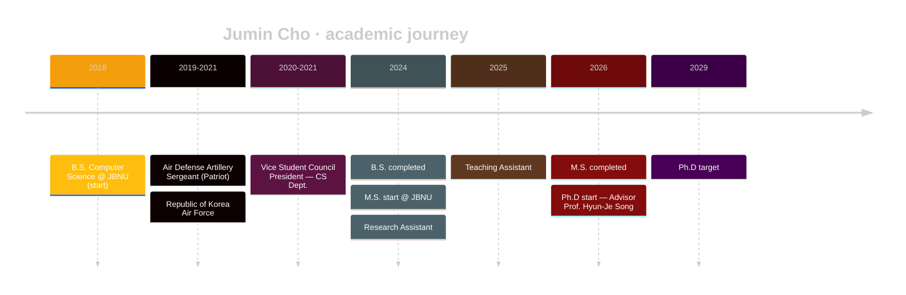

<!-- ============================ HEADER ============================ -->

<a href="#"></a>

<!-- ============================ INTRO ============================ -->

<div align="center">

<a href="https://github.com/jumincho"></a>

</div>

<!-- ============================ WALKOUT ============================ -->

<div align="center">


<sub><i>Nation · Club · Position · Player — an FC-series walkout, fully hand-rolled in pure SVG/SMIL.</i></sub>

</div>

<br/>

<!-- ============================ ABOUT ============================ -->

## <samp>$\color{#F59E0B}\textsf{// whoami}$</samp>

```yaml
name        : Jumin Cho (조주민)
title       : AI Researcher · Ph.D Student
affiliation : Jeonbuk National University (JBNU)
lab         : NLLLab — sites.google.com/view/nlllab/main
advisor     : Prof. Hyun-Je Song
location    : Jeonju, South Korea 🇰🇷
mission     : Make machines that reason as honestly as they generate.
email       : properly59@gmail.com
portfolio   : jumincho.github.io/juminwho/
```

<!-- ============================ FOCUS ============================ -->

## <samp>$\color{#F59E0B}\textsf{// research}$</samp>

<table>
<tr>
<td valign="top" width="33%">

### 🧠 Reasoning LLMs
Structured & retrieval-augmented reasoning for long-form generation.

</td>
<td valign="top" width="33%">

### 📚 Causality in NLP
Causality-aware models for high-stakes domains (e.g. radiology reports).

</td>
<td valign="top" width="33%">

### 🤝 Trustworthy AI
Faithful, calibrated, and grounded language model outputs.

</td>
</tr>
</table>

> 📄 **Latest:** *Optimizing Causality-Based Radiology Reporting with Retrieval-Augmented and Structured Reasoning Approaches for the NTCIR-18 HIDDEN-RAD Task.*

<!-- ============================ STACK ============================ -->

## <samp>$\color{#F59E0B}\textsf{// stack}$</samp>

<p align="center">
  
</p>

<!-- ============================ STATS ============================ -->

## <samp>$\color{#F59E0B}\textsf{// stats}$</samp>

<div align="center">

<a href="https://github.com/jumincho">
  
  
</a>

<br/>

<a href="https://github.com/jumincho">
  
</a>

<br/><br/>

<a href="https://github.com/ryo-ma/github-profile-trophy">
  
</a>

</div>

<!-- ============================ ACTIVITY ============================ -->

## <samp>$\color{#F59E0B}\textsf{// activity}$</samp>

<div align="center">

<a href="https://github.com/jumincho">
  
</a>

</div>

<!-- ============================ SNAKE ============================ -->

<div align="center">

<picture>
  <source media="(prefers-color-scheme: dark)" srcset="https://raw.githubusercontent.com/jumincho/jumincho/output/github-snake-dark.svg" />
  <source media="(prefers-color-scheme: light)" srcset="https://raw.githubusercontent.com/jumincho/jumincho/output/github-snake.svg" />
  
</picture>

</div>

<!-- ============================ TIMELINE ============================ -->

## <samp>$\color{#F59E0B}\textsf{// timeline}$</samp>



<!-- ============================ AWARDS ============================ -->

## <samp>$\color{#F59E0B}\textsf{// honors}$</samp>

<table>
<tr>
<td>🏆</td><td><b>Excellence Award</b> — AI-JBNU Program</td>
</tr>
<tr>
<td>🥉</td><td><b>2nd Runner-up</b> — Department of Computer Science Project Competition</td>
</tr>
<tr>
<td>🛰️</td><td><b>Unmanned Multi-Copter Pilot License</b> (Class 2)</td>
</tr>
</table>

<!-- ============================ CONTACT ============================ -->

## <samp>$\color{#F59E0B}\textsf{// connect}$</samp>

<p align="center">
  <a href="mailto:properly59@gmail.com"></a>
  <a href="https://www.linkedin.com/in/jumincho-42b126338"></a>
  <a href="https://sites.google.com/view/nlllab/main"></a>
  <a href="https://jumincho.github.io/juminwho/"></a>
</p>

<p align="center">
  
  
</p>

<!-- ============================ QUOTE ============================ -->

<div align="center">

<br/>


</div>

<!-- ============================ FOOTER ============================ -->

<a href="#"></a>
